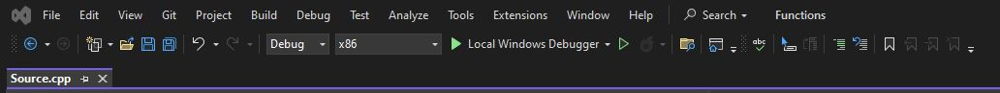
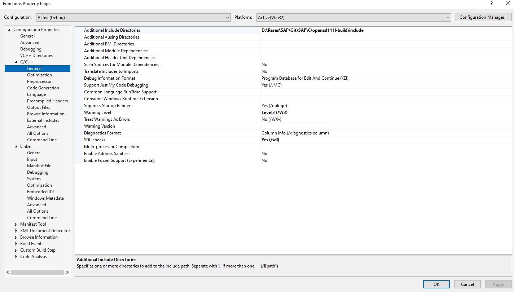
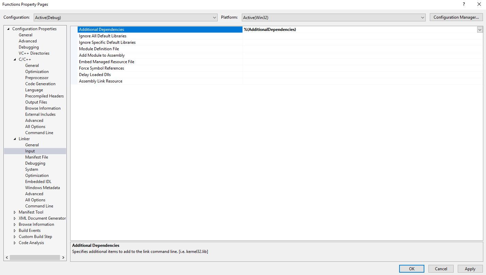
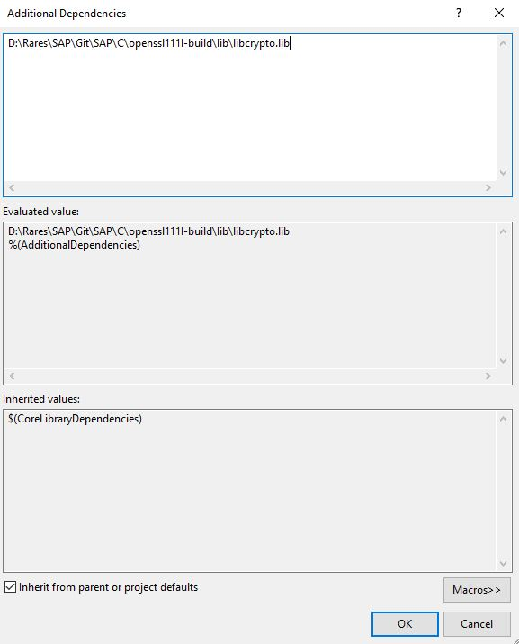
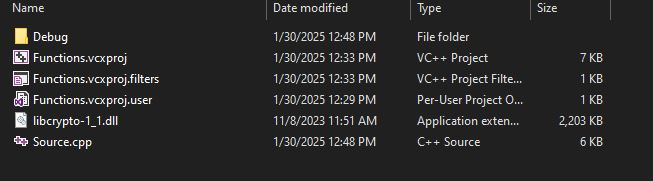

# SAP Exam Preparation

- **Java/C labs**
- **Java/C exams**

## C/C++ Setup

### 1. Add Source File
- Add your `.cpp` source file and select the **x86 architecture**.
  
  

    
  

### 2. Download and Set Up OpenSSL
- Download **OpenSSL** and unzip the files.

### 3. Configure Project Properties
- Open the **Project Properties** by right clicking on the project.

### 4. Set Up Include Directories
- Go to **C/C++ -> General**.
- Add the include directory path to **Additional Include Directories**.

  

    
  

### 5. Add Additional Dependencies
- Go to **Linker -> Input**.
- Add `libcrypto.lib` to **Additional Dependencies**.

  Click on the field and select **Edit**, then add the `libcrypto.lib` file.

  

    
  

  

    
  

### 6. Apply Changes
- Click **Apply** and **OK** to save your changes.

### 7. Add DLL File
- Place the `libcrypto-1_1.dll` file (found in the **openssl111l-build\bin** folder) in the root directory of your project (where `source.cpp` is located).

  

    
  
